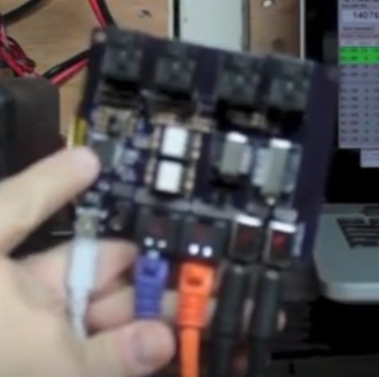

# AJ9BM's DX-SR8 Serial Interface

Back in 2013 AJ9BM did an analysis of the communication between the DX-SR8's chassis and its front panel. He found out a great deal about the protocol and built working prototypes but for some reason he abandoned the project.
 

Before he did he released the python analysis code in /aj9bm_code [on Github](https://github.com/jbm9/dxsr8_serial) and a couple of videos on YouTube. [Showing the analysis code running](https://www.youtube.com/watch?v=cRo2k7FbKFA),  [a prototype board controlling the rig](https://www.youtube.com/watch?v=0eBNIf6Rozc), and [another of a more finished prototype board controlling the rig](https://www.youtube.com/watch?v=aqtLbdCvwj8).

Unfortunately at that point he abandoned the project and never released the board design or the final code.

