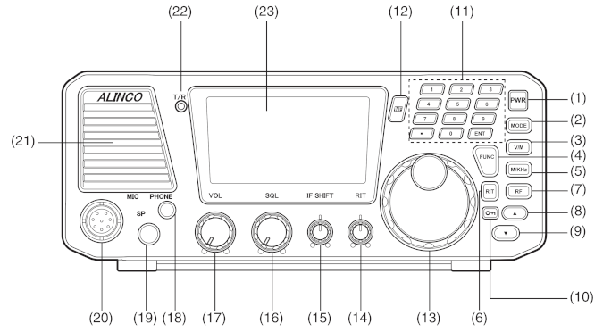
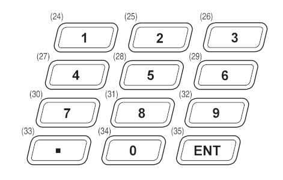
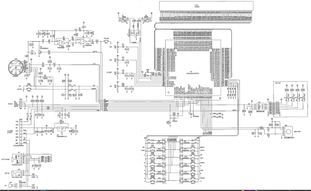

# DX-SR8 Head/Chassis Protocol

TODO:

- add examples and explainations for head to chassis part.

- document the chassis to head part.

---

## Introduction

The DXSR8's control head is connected to the chassis by a standard ethernet type cable with RJ45 connectors. It's not ethernet but it uses the same cable.

They communicate via two TTL level (5v) serial lines at 38400 8N1. They should not be directly connected to a 3.3v processor.

Most of the protocol was figured out by [AJ9BM](../aj9bm.md) back in 2013. He didn't produce documentation but it's in the python analysis code he released.

---

## Packets sent at powerup

b'AL~READY\r\n'

b'SWDA0000000081718AA1800100\r\n'

b'SWDV81728AA10100\r\n'

---

## Packets sent head to chassis

### AL~READY

b'AL~READY\r\n'

### SWDV

Contains rit, ifshift, squelch, and volume.

This is the most common packet because the values of these knobs jitter a little bit. These four are potentiometers and are read by ADCs (analog to digital converters). You get this even if you aren't touching the controls. They vary plus or minus one or two.

### SWDR

Contains the direction of rotation of the frequency dial

### SWDA

Related to the frequency dial? We get this packet when we spin the dial rapidly.

### SWDS

Contains the switches on the front panel excluding the power switch.
    
---

## Packets sent chassis to head

### AL~READY

b'AL~READY\r\n'

### LCSA

This contains bits controlling the LCD segments, LEDs, and display backlight. It seems to be the only thing the radio chassis transmits other than the initial ready message. It's sent continuously.

Details coming soon.

---

## Images of Display, Keys, and Head Schematic

Click for larger version.

